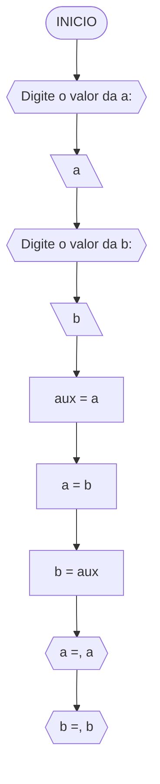
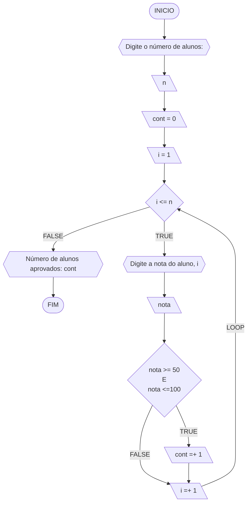
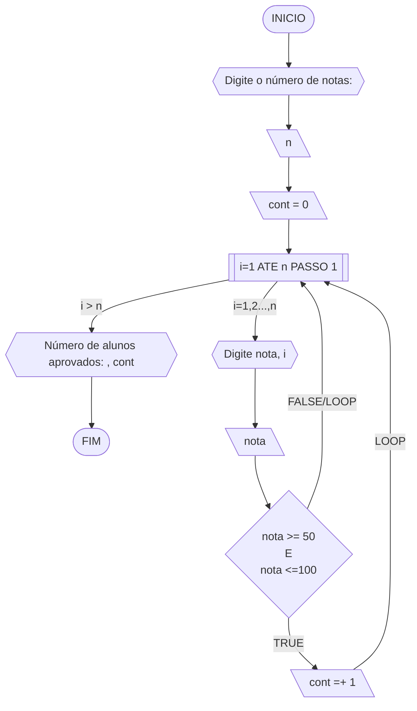
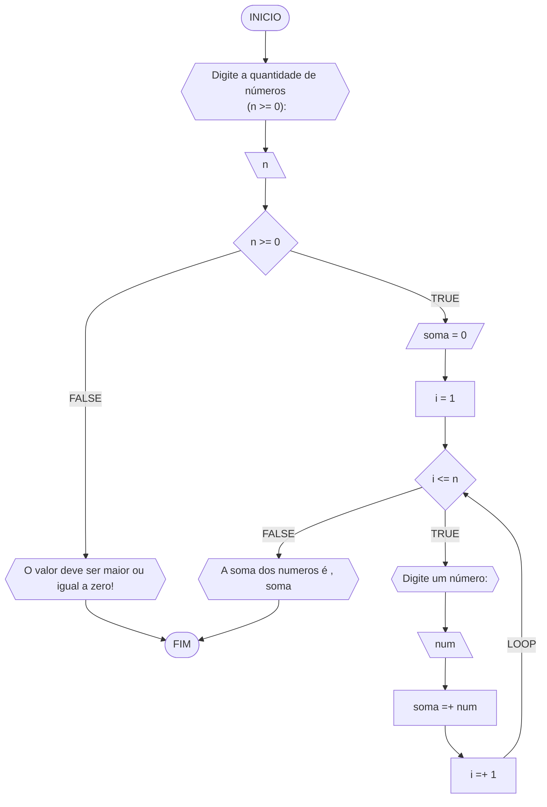
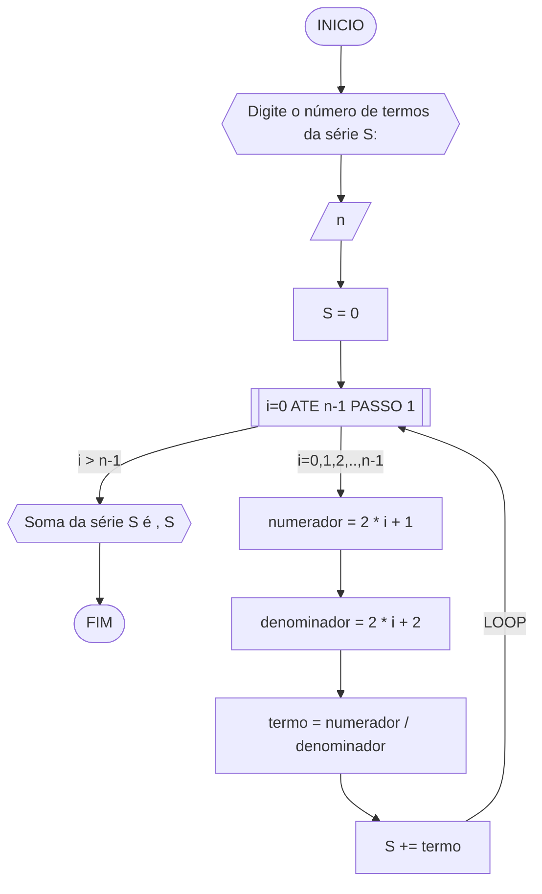
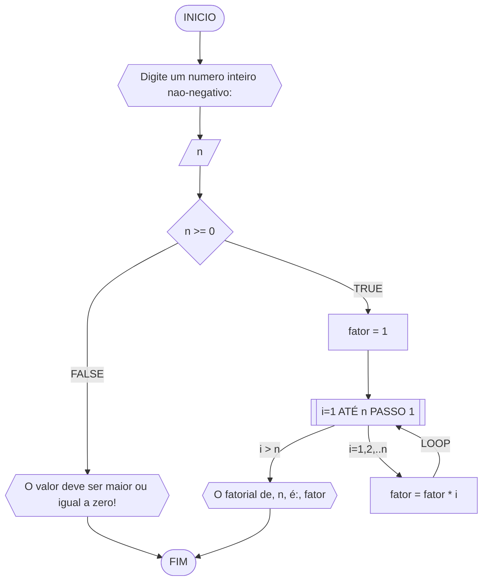
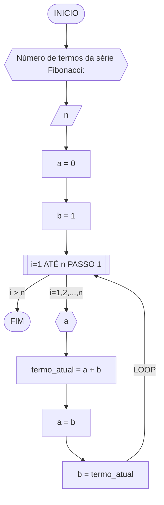
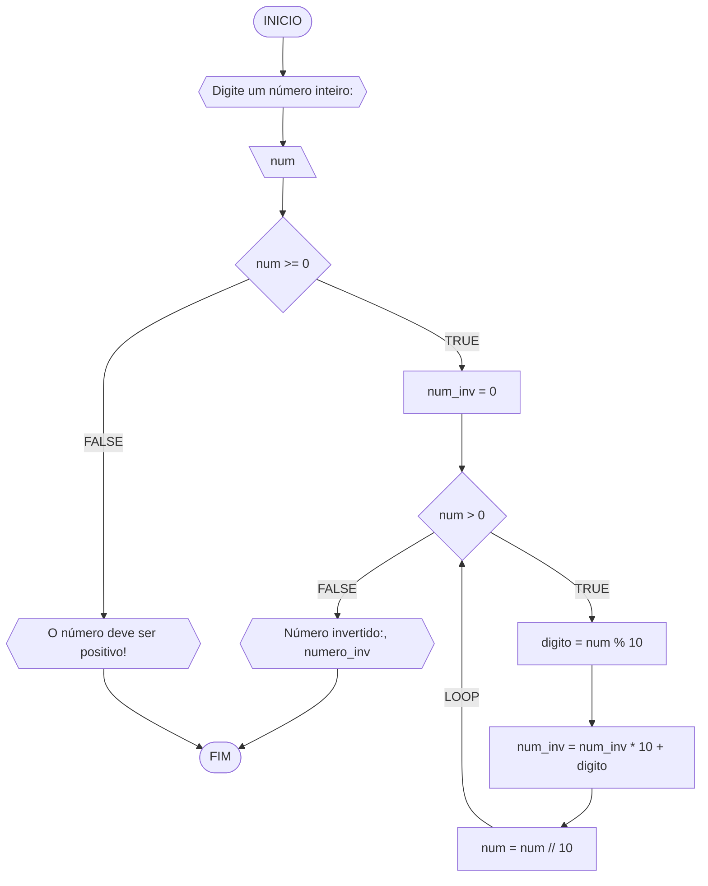

**Curso:** ciencia da computação <br>
**Disciplina:** Raciocínio lógico algorítmico <br>
**Código/Turma:** T160-39 <br>
**Professor:** Ricardo Carubbi <br>
**Data:** 20/03/2024 <br>
**Aluno(a):** Rinee Alves Matos De Sousa <br>
**Matrícula:** 2417146 <br>

**1a chamada (Sim/Não):** sim <br>
**2a chamada (Sim/Não):** nao

## Lista de questões

### Questão 1 - Troca dos valores de duas variáveis (1 ponto)

Dadas duas variáveis, $a$ e $b$, implemente e teste um algoritmo para trocar os valores atribuídos a elas.

#### Descrição geral do algoritmo

1. Guardar o valor original da variável $a$ em uma variável auxiliar $aux$;
2. Atribuir à variável $a$ o valor original da variável $b$;
3. Atribuir à variável $b$ o valor original da variável $a$, que está armazenado na variável auxiliar $aux$.
4. Exibir os novos valores de $a$ e $b$.

#### Fluxograma



#### Pseudocódigo (1 ponto)

```java
ALGORTIMO TrocaValores
DECLARE a,b,axu: REAL

INICIO

    // variavel a,b como dado de entrada 
    ESCREVA "Digite o valor da a:"

    // variavel leia comceça com a 
    LEIA a

    // variavel escreva o valo.r de b 
    ESCREVA "Digite o valor da b:"

    // variavel leia b 
    LEIA b

    // loop condicional 
    aux <- a 

    // atribuir B a A
    a <- b

    // indica que o valor da variável "aux" está sendo atribuído à variável "b"
    b <- aux

    // Aqui, "a=" e "b=" são strings que precedem os valores das variáveis "a" e "b"
    ESCREVA "a=", a
    ESCREVA "b=", b

FIM
```

#### Tabela de testes

| a  | b  | aux | a  | b  | saída 1 | saída 2 | 
| -- | -- | --  | -- | -- | --      | --      | 
| 0  | 1  | 0   | 1  | 0  | a = 1   | b = 0   |

### Questão 2 - Contagem (1 ponto)

Dado um conjunto $n$ de notas de alunos em um exame, implemente e teste um algoritmo para fazer uma contagem $cont$ do número de alunos que foram aprovados no exame. 
Será considerado aprovado o aluno que tirar $nota$ 50 ou maior (no intervalo de 0 a 100).

#### Descrição geral do algoritmo

1. Obter o número de notas $n$ a serem processadas;
2. Inicializar a contagem $cont$ com zero;
3. Enquanto houver notas a serem processadas, fazer repetidamente:
    - obter a próxima nota;
    - se a nota for suficiente para passar no exame ($n ≥ 50$) então adicionar 1 (um) à contagem $cont$;
4. Exibir a contagem $cont$ (número total de aprovações).

#### Fluxograma 01
Fluxograma conforme descrição do algoritmo acima, usando o loop ENQUANTO.



#### Fluxograma 02
Fluxograma opcional usando o loop PARA.



#### Pseudocódigo 01 (1 ponto)

```java
ALGORTIMO ContaAprovacoes
DECLARE n, cont, nota, i: INTEIRO

INICIO

    // solicitar uma entrada de dados ao usuário.
    ESCREVA "Digite a quantidade de notas dos alunos:"

    // atribuí-lo à variável "n" e entrada de dados 
    LEIA n

    //  "cont" é uma variável que está sendo inicializada com o valor zero
    cont = 0 

    //  loop que itera de 1 até o valor de "n". Durante cada iteração do loop, a variável "i" assume um valor diferente, começando de 1 e indo até "n".
    PARA i DE 1 ATE n FAÇA

        // solicitar ao usuário que insira a nota de um aluno específico.
        ESCREVA "Digite a nota do aluno", i, ":"

        // uma entrada de dados fornecida pelo usuário e armazená-la na variável "nota".
        LEIA nota

        //  representa uma estrutura condicional comum 
        SE nota >= 50 E nota <= 100 ENTAO

            //  usada para incrementar o valor da variável "cont" em 1 unidade.
            cont = cont + 1 

        FIM_SE

    FIM_PARA

    // cont" é utilizado para exibir o número de alunos que foram aprovados em um determinado contexto. 
    ESCREVA "O numero de alunos aprovados e:", cont

FIM
```

#### Tabela de testes 01
Tabela de testes referente ao algoritmo usando o loop ENQUANTO.

| it | n  | i  | cont | i<=n  | nota, i | nota | nota_valida | cont+1 | i+1 | saída        | 
| -- | -- | -- | --   | --    | --      | --   | --          | --     | --  | --           |
| 1  | 3  | 1  |  0   | True  | nota 1  | 60   | True        | 1      | 2   |              |
| 2  | 3  | 2  |  1   | True  | nota 2  | 40   | False       | 1      | 3   |              |
| 3  | 3  | 3  |  1   | True  | nota 3  | 90   | True        | 2      | 4   |              |
| 4  | 3  | 4  |  2   | False |         |      |             |        |     | Aprovados: 2 |

#### Tabela de testes 02
Tabela de testes referente ao algoritmo usando o loop PARA.

| it | n  | cont | i  | nota, i | nota | nota_valida | cont+1 | saída        | 
| -- | -- | --   | -- | --      | --   | --          | --     | --           |
| 1  | 3  | 0    | 1  | nota 1  | 60   | True        | 1      |              |
| 2  | 3  | 1    | 2  | nota 2  | 40   | False       | 1      |              |
| 3  | 3  | 1    | 3  | nota 3  | 90   | True        | 2      | Aprovados: 2 |

### Questão 3 - Soma de um conjunto de números (1 ponto)

Dado um conjunto de $n$ números, implemente e teste um algoritmo para calcular a soma desses números. <br>
Aceite apenas $n$ maior ou igual a zero.

#### Descrição geral do algoritmo

1. Obter a quantidade de números $n$ a serem somados.
2. Inicializar a variável $soma$ com 0 (zero).
3. Enquanto menos do que $n$ números tiverem sido somados, fazer repetidamente:
    - obter o próximo número $i$;
    - calcular a soma atual, adicionando o número $i$ obtido à soma mais recente;
4. Exibir a soma dos $n$ números

#### Fluxograma



#### Pseudocódigo (1 ponto)

```java
Algoritmo SomaNumeros
DECLARE n,i,soma: INTEIRO

INICIO

    // especifica que "n" deve ser maior ou igual a zero, fornecendo uma restrição importante para o usuário seguir. 
    ESCREVA "Digite a quantidade de números<br> (n >= 0):"
    LEIA n

    // é uma estrutura condicional que verifica se o valor da variável "n" é maior ou igual a zero. 
    SE n >=0 ENTAO

        //  inicializa a variável "soma" com o valor zero. 
        soma <- 0

        //  em loops, para atualizar o valor de uma variável de iteração.
        i <- i

        // . Ele define que um bloco de código será executado repetidamente enquanto a condição "i <= n" for verdadeira.
        ENQUANTO i <= n FAÇA

            // é uma instrução que indica ao usuário para inserir um número através da entrada de dados.
            ESCREVA "Digite um número:"

            // é utilizado para capturar um valor inserido pelo usuário através da entrada padrão (como o teclado) e armazená-lo na variável "num".
            LEIA num 

            //  é utilizado para acumular valores em uma variável chamada "soma". 
            soma <- soma + num

            // aumentar o valor da variável "i" em uma unidade. 
            i <- i + 1

        FIM_ENQUANTO

    //usada para fornecer feedback ao usuário quando uma condição específica não é satisfeita. 
    SENAO
        "O valor deve ser maior ou igual a zero!"

    FIM_SE

    
   
FIM
```

#### Tabela de testes

| it | n  | n >= 0 | soma | i  | i <= n | num | soma =+ num  | saída                   |
| -- | -- | --     | --   | -- | --     | --  | --           | --                      |
|    | -3 | False  |      |    |        |     |              | O valor deve ser ...    |
| 1  | 0  | True   | 0    | 1  | False  |     |              | A soma dos números é 0  |
| 1  | 3  | True   | 0    | 1  | True   | 5   | 0 + 5 = 5    |                         |
| 2  | 3  | True   | 5    | 2  | True   | 10  | 5 + 10 = 15  |                         |
| 3  | 3  | True   | 15   | 3  | True   | 20  | 15 + 20 = 35 |                         |
| 4  | 3  | True   | 35   | 4  | False  |     |              | A soma dos números é 35 |

### Questão 4 - Cálculo de uma série (1 ponto)

Dado um conjunto de $n$ termos da série, implemente e teste um algoritmo para calcular o valor de S, conforme definido abaixo:

$$ S = \frac{1}{2} + \frac{3}{4} + \frac{5}{6} + \frac{7}{8} + \dots $$

#### Descrição geral do algoritmo

1. Obter o número de termos $n$;
2. Inicializar a variável $S$ com 0 (zero).
3. Iterar o valor de $n$ na variável $i$ iniciando com 0 (zero), de acordo com as instruções abaixo:
    - calcular o numerador na variável $numerador$;
    - calcular o denominador  na variável $denominador$;;
    - calcular o termo da série na variável $termo$, onde $termo = numerador/denominador$;
    - adicionar esse termo à variável $S$.
4. Exibir o valor da série $S$.

#### Fluxograma



#### Pseudocódigo (1 ponto)

```java
Algoritmo SomaSerie
DECLARE n,numerador,denominador: INTEIRO; termo, S: REAL

INICIO

    // é utilizado para solicitar ao usuário que insira o número de termos desejados para uma série,
    ESCREVA "Digite o número de termos da série S:"

    //é utilizado para capturar um valor inserido pelo usuário através da entrada padrão (como o teclado) e armazená-lo na variável "n"
    LEIA n

    //  Inicializar "S" como zero é útil para garantir que a variável esteja pronta para acumular valores ou para reiniciar o cálculo de uma nova série de operações.
    S <- 0

    //  estabelece um loop que itera sobre os valores de "i" de 0 até "n-1", com um incremento de 1 a cada iteração. 
    PARA i de 0 ATÉ n-1 PASSO 1 FAÇA

        //  calcula o valor do numerador em uma operação ou equação. 
        numerador = 2 * i + 1

        // calcula o valor do denominador em uma operação ou equação.
        denominador <- 2 * i + 2

        //  representam os valores do numerador e do denominador, respectivamente, que foram calculados previamente para um determinado índice "i".
        termo = numerador / denominador

        //  é uma forma abreviada de adicionar o valor do termo atual à variável acumuladora "S".
        S += termo

    FIM_PARA

    // é usado para exibir a soma da série S ao usuário. Após calcular a soma dos termos da série e armazená-la na variável S, este comando imprime uma mensagem informativa na tela, seguida pelo valor atual da soma (S).
    ESCREVA "Soma da série S é ", S

FIM
```

#### Tabela de testes (0.25 ponto)

| it | n  | S  | i | numerador | denominador | termo | S += termo     | saída                  |
| -- | -- | -- |-- | --        | --          | --    | --             | --                     |
|    | 0  | 0  |   |           |             |       |                |                        |
| 1  | 4  | 0  | 0 | 2*0+1 = 1 | 2*0+2 = 2   | 1/2   | 0+1/2 = 1/2    |                        |
| 2  | 4  | 0  | 1 | 2*1+1 = 1 | 2*1+2 = 2   | 3/4   | 1/2+3/4 = 1.25 |                        |
| 3  | 4  | 0  | 2 | 2*2+1 = 1 | 2*2+2 = 2   | 5/6   | 0+1/2 = 2.08   |                        |
| 4  | 4  | 0  | 3 | 2*3+1 = 1 | 2*3+2 = 2   | 7/8   | 0+1/2 = 2.96   | Soma da série S é 2.96 |

### Questão 5 - Cálculo fatorial (2 pontos)

Dado um número $n$, implemente e teste um algoritmo para calcular o fatorial de $n$ (escrito como $n!$), onde $n ≥ 0$.

#### Descrição geral do algoritmo

1. Obter o número $n$, onde $n \geq 0$;
2. Inicializar a variável $fator$ com 1 (um) para armazenar o resultado do cálculo do fatorial;
3. Iterar o valor de $n$ na variável $i$, ou seja, executar $n$ vezes, as instruções abaixo:
    - Incrementar o valor atual $fator$ multiplicando pelo valor de $i$;
4. Exibir o resultado ($n!$).

#### Fluxograma



#### Pseudocódigo (2 pontos)

```java
ALGORITMO CalcFatorial
DECLARE n: INTEIRO

INICIO

    //  é uma instrução que solicita ao usuário que insira um número inteiro não-negativo através da entrada padrão
    ESCREVA "Digite um numero inteiro nao-negativo:"

    //  é usado para capturar a entrada do usuário e atribuí-la à variável "n". 
    LEIA n

    // introduz uma estrutura condicional na qual o programa avalia se o valor de "n" é maior ou igual a zero. 
    SE n >= 0 ENTAO

        // "fator" provavelmente será usado para armazenar ou calcular um fator de multiplicação, exponenciação ou outro tipo de operação matemática
        fator <- 1

        // é usado para executar um bloco de código repetidamente enquanto "i" está dentro do intervalo especificado. 
        PARA i DE 1 ATÉ n PASSO 1 FAÇA

            // atualiza o valor da variável "fator" multiplicando seu valor pelo valor da variável "i". 
            fator <- fator * i        // fator *= i

        FIM_PARA

        //  é usado para exibir a mensagem "O fatorial de [valor de n] é: [valor do fatorial]" para o usuário
        ESCREVA "O fatorial de, n, é:", fator

    // é uma estrutura condicional que executa uma ação caso a condição anterior não seja atendida. 
    SENAO
        ESCREVA "O valor deve ser maior ou igual a zero!"
    FIM_SE

FIM
```

#### Tabela de testes

| n  | fator | i  | fator = fator * i | saída               |
| -- | --    | -- | --                | --                  |
| 3  | 1     | 1  | 1*1 = 1           |                     |
| 3  | 1     | 2  | 1*2 = 2           |                     |
| 3  | 2     | 3  | 2*3 = 6           | O fatorial de 3 é 6 |

### Questão 6 - Geração da sequência de Fibonacci (2 pontos)

Gerar e imprimir os $n$ primeiros termos da sequência de Fibonacci, onde $n ≥ 1$. <br>
Os primeiros termos são: $0, 1, 1, 2, 3, 5, 8, 13, \dots$. Cada termo, além dos dois primeiros, é derivado da soma dos seus dois antecessores mais próximos.

#### Descrição geral do algoritmo

1. Obter o número de termos $n$, onde $n \geq 1$;
2. Inicializar os dois primeiros termos da série nas variável $a$ e $b$ com 0 (zero);
3. Iterar o valor de $n$, ou seja, executar $n$ vezes, as instruções abaixo:
    - Imprimir o termo inicial $a$ (instrução para exibir a sequência ao atualizar a variável $a$);
    - Somar os termos $a$ e $b$ na variável $termo_atual$;
    - Atribuir a variável $a$ o valor da variável $b$;
    - Atribuir a variável $b$ o valor da variável $termo_atual$.

#### Fluxograma



#### Pseudocódigo (2 pontos)

```java
ALGORITMO GeraFibonacci
DECLARE n, a, b, termo_atual: INTEIRO

INICIO

    // "Número de termos da série Fibonacci:"" é utilizado para exibir uma mensagem informativa solicitando ao usuário que insira o número de termos desejados para a série Fibonacci.
    ESCREVA "Número de termos da série Fibonacci:"

    // Após o usuário inserir o número desejado de termos para a série Fibonacci, o programa lê essa entrada e a atribui à variável "n" para uso posterior. 
    LEIA n

    //  Neste caso, "a" pode representar um contador, um acumulador ou qualquer outra variável que requer uma inicialização antes de seu uso. 
    a <- 0

    //b" pode representar uma variável de contador, um acumulador ou qualquer outra variável que requer uma inicialização antes de seu uso.
    b <- 1

    //  é usado para iniciar um loop que iterará de 1 até o valor de "n". 
    PARA i DE 1 ATE n FAÇA

        // é usado para exibir o valor da variável "a" na saída do programa. 
        ESCREVA a

        // Este comando é essencial para realizar cálculos e atualizar variáveis no decorrer da execução do programa.
        termo_atual <- a + b

        // usado para atribuir o valor da variável "b" à variável "a".
        a <- b

        // é um comando que define o valor da variável "b" como sendo igual ao valor do termo atual. 
        b <- termo_atual

    FIM_PARA
FIM

```
#### Tabela de testes

| it | n  | a  | b  | i  | saída | termo_atual = a + b | a = b | b = termo_atual |
| -- | -- | -- | -- | -- | --    | --                  | --    | --              |
| 1  | 5  | 0  | 1  | 1  | 0     | 0 + 1 = 1           | 1     | 1               |
| 2  | 5  | 1  | 1  | 2  | 1     | 1 + 1 = 2           | 1     | 2               |
| 3  | 5  | 1  | 2  | 3  | 1     | 1 + 2 = 3           | 2     | 3               |
| 4  | 5  | 2  | 3  | 4  | 2     | 2 + 3 = 5           | 3     | 5               |
| 4  | 5  | 3  | 5  | 5  | 3     | 3 + 5 = 8           | 5     | 8               |

### Questão 7 - Inversão dos dígitos de um número inteiro (2 pontos)

Implemente e teste um algoritmo para inverter a ordem dos dígitos de um número inteiro positivo.

#### Descrição geral do algoritmo

1. Obter o número inteiro positivo $num$ a ser invertido;
2. Inicializar a variável $num \textunderscore inv$ com 0 (zero);
3. Enquanto o número for maior que zero ($num > 0$), faça repetidamente:
    - Calcular o último dígito do número na variável $digito$;
    - Adicionar o dígito ao número invertido $num \textunderscore inv$;
    - Remover o último dígito do número original $num$; 
4. Exibir o número invertido.

#### Fluxograma



#### Pseudocódigo (2 pontos)

```java
Algoritmo InverteInteiro
DECLARE num, num_inv, digito: INTEIRO

INICIO

    // exibe uma mensagem para o usuário, solicitando que ele insira um número a ser invertido
    ESCREVA "Digite o número a ser invertido:"
    LEIA num

    //introduz uma estrutura condicional que verifica se o número inserido pelo usuário é menor que zero
    SE num < 0 ENTAO

        // é usado para informar ao usuário que o número inserido deve ser positivo.
        ESCREVA "O número deve ser positivo!"

    // Esta parte do código será executada quando o número inserido for positivo ou zero.
    SENAO

        //  indicando uma preparação para a operação de inversão que provavelmente virá em seguida no código.
        num_inv <- 0

        // introduz um loop que continuará executando o bloco de código abaixo dele enquanto a condição "num > 0" for verdadeira.
        ENQUANTO num > 0 FAÇA

            // extrai o último dígito de um número inteiro.
            digito <- num % 10

            //  é utilizado para construir o número invertido, acumulando os dígitos invertidos obtidos em cada iteração do loop.
            num_inv <- (num_inv * 10) + digito

            //é utilizado para remover o último dígito do número "num", dividindo-o por 10 e atribuindo o resultado de volta à variável "num".
            num <- num // 10

        //  usado para exibir o número invertido na saída do programa. 
        ESCREVA "Número invertido:", num_inv

    FIM_SE

FIM
```

#### Tabela de testes

| it | num | num_inv | num > 0 | digito | num = num // 10 | num_inv = (num_inv * 10) + digito | Saída                        |
| -- | --  | --      | --     | --      | --              | --                                | --                           |
|    | -1  | 0       | False  |         |                 |                                   | O número deve ser positivo!  |
| 1  | 0   | 0       | False  |         |                 |                                   | Número invertido:: 0         |
| 1  | 42  | 0       | True   | 2       | 4               | 2                                 |                              |
| 2  | 4   | 2       | True   | 4       | 0               | 24                                |                              |
| 3  | 0   | 24      | False  |         |                 |                                   | Número invertido:: 24        |
