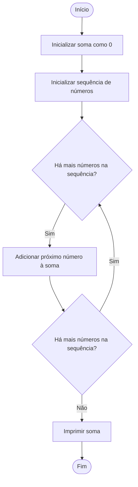

### Exercicio 1

### Pseudocodigo
```
1  ALGORITMO verificar_par_ou_impar
2  DECLARE numero: INTEIRO
3  INICIO
4    REPITA
5        ESCREVA "Digite um número inteiro positivo: "
6        LEIA numero
7        
8        SE numero < 0 ENTÃO
9            ESCREVA "Número inválido. Por favor, digite um número inteiro positivo."
10       FIM_SE
11   ATÉ que numero >= 0
12   
13   SE numero MOD 2 = 0 ENTÃO
14       ESCREVA numero, " é um número par."
15   SENÃO
16       ESCREVA numero, " é um número ímpar."
17   FIM_SE
18   
19   FIM
```
### Teste de mesa
Vamos criar uma tabela semelhante usando o pseudocódigo fornecido:

| número | número >= 0 | resto | resto == 0 | Saída |
| ------ | ----------- | ----- | ---------- | ------|
| -1     | F           |       |            | "Número inválido. Por favor, digite um número inteiro positivo." |
| 0      | V           | 0     | V          | "0 é um número par." |
| 13     | V           | 1     | F          | "13 é um número ímpar." |
| 30     | V           | 0     | V          | "30 é um número par." |

### Exercicio 2

### Fluxograma

### Pseudocodigo
```
1  ALGORITMO exibir_multiplos_de_3
2  DECLARE contador: INTEIRO
3  INICIO
4    PARA contador DE 0 ATÉ 30 PASSO 3 FAÇA
5        ESCREVA contador
6    FIM_PARA
7   
8    FIM

```
### Teste de mesa

| contador | contador é múltiplo de 3 | Saída |
| -------- | ------------------------ | ------|
| 0        | V                        | 0     |
| 3        | V                        | 3     |
| 6        | V                        | 6     |
| 9        | V                        | 9     |
| 12       | V                        | 12    |
| 15       | V                        | 15    |
| 18       | V                        | 18    |
| 21       | V                        | 21    |
| 24       | V                        | 24    |
| 27       | V                        | 27    |
| 30       | V                        | 30    |

### Exercicio 3

### Fluxograma

### Pseudocodigos
```
1  ALGORITMO calcular_soma_sequencia
2  DECLARE sequencia: VETOR DE INTEIRO
3  DECLARE tamanho, soma, i: INTEIRO
4  INICIO
5    tamanho <- tamanho do vetor sequencia
6    soma <- 0
7    
8    // Preencher o vetor sequencia
9    PARA i DE 0 ATÉ tamanho - 1 FAÇA
10       ESCREVA "Digite o elemento ", i + 1, " da sequência: "
11       LEIA sequencia[i]
12   FIM_PARA
13   
14   // Calcular a soma da sequência
15   PARA i DE 0 ATÉ tamanho - 1 FAÇA
16       soma <- soma + sequencia[i]
17   FIM_PARA
18   
19   ESCREVA "A soma da sequência é: ", soma
20   
21   FIM

```
### Teste de mesa

| Sequência | Tamanho | Soma | Saída |
| --------- | ------- | ---- | ----- |
| {2, 5, 8} | 3       | 15   | "A soma da sequência é: 15" |

### Exercicio 4

### Fluxograma 

### Pseudocodigo
```
1  ALGORITMO calcular_media_alunos
2  DECLARE nota, soma, contador: REAL
3  DECLARE quantidade_notas: INTEIRO
4  INICIO
5    soma <- 0
6    contador <- 0
7    
8    REPITA
9        ESCREVA "Digite a nota do aluno (ou uma nota negativa para encerrar): "
10       LEIA nota
11       
12       SE nota >= 0 ENTÃO
13           soma <- soma + nota
14           contador <- contador + 1
15       FIM_SE
16   ATÉ que nota < 0
17   
18   SE contador > 0 ENTÃO
19       quantidade_notas <- contador
20       media <- soma / contador
21       ESCREVA "Foram lidas ", quantidade_notas, " notas."
22       ESCREVA "A média aritmética é ", media, "!"
23   SENÃO
24       ESCREVA "Nenhuma nota foi inserida!"
25   FIM_SE
26   
27   FIM
```
### Teste de mesa
| Nota | Nota >= 0 | Soma | Contador | Saída |
| ---- | --------- | ---- | -------- | ------|
| 5.0  | V         | 5.0  | 1        | |
| 7.5  | V         | 12.5 | 2        | |
| -1   | F         |      |          | "Foram lidas 2 notas. A média aritmética é 6.25!" |
