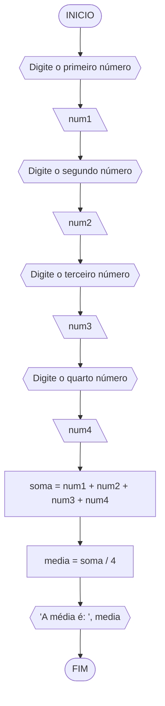
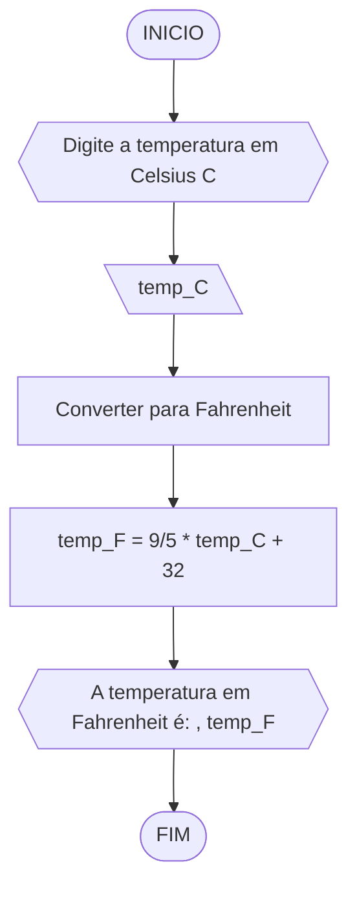
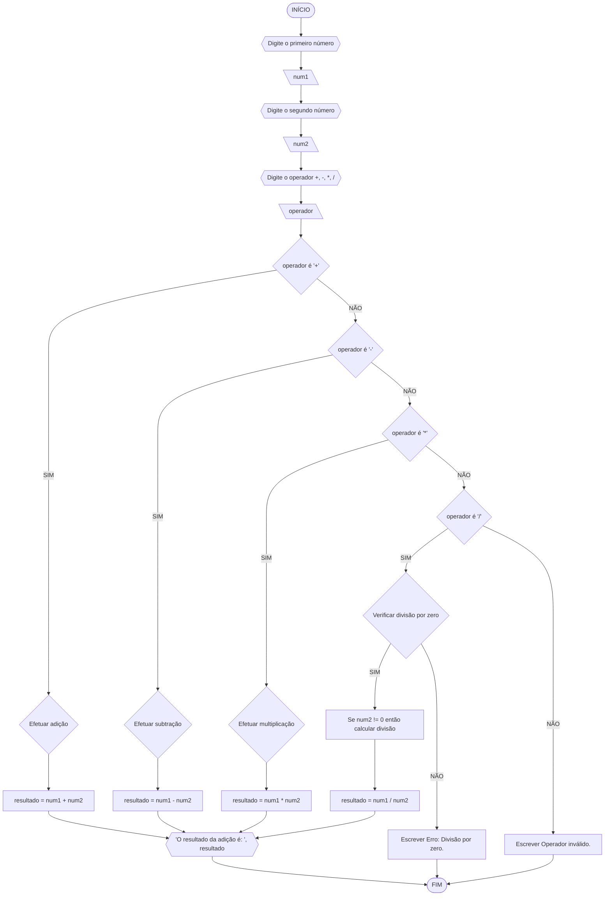
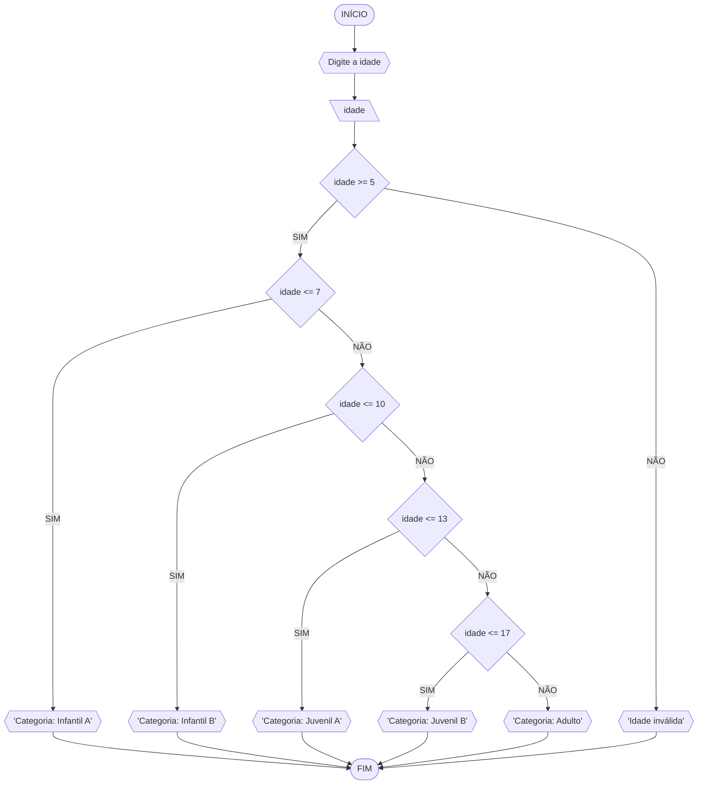

# UNIFOR
**nome**: rinee alves 
**disciplina**:Raciocínio logico algorítmico 
## Lista 2 

### Exercicio 1
### Fluxograma

### Pseudocodigo
```
1  ALGORITMO calcular_media
2  DECLARE num1, num2, num3, num4, soma, media: REAL
3  INICIO
4    ESCREVA "Digite o primeiro número: "
5    LEIA num1
6    ESCREVA "Digite o segundo número: "
7    LEIA num2
8    ESCREVA "Digite o terceiro número: "
9    LEIA num3
10   ESCREVA "Digite o quarto número: "
11   LEIA num4
12   soma = num1 + num2 + num3 + num4
13   media = soma / 4
14   ESCREVA "A média é: ", media
15 FIM

```
### Teste de mesa


| Teste | num1 | num2 | num3 | num4 | soma (cálculo esperado) | média (cálculo esperado) | Saída esperada |
| ----- | ---- | ---- | ---- | ---- | ----------------------- | ------------------------ | --------------- |
| 1     | 2    | 4    | 6    | 8    | 20 (2 + 4 + 6 + 8)      | 5                        | "A média é: 5"  |

### Exercicio 2

### Fluxograma

### Pseucodigo
```
1  ALGORITMO converter_temperatura
2  DECLARE temp_C, temp_F: REAL
3  INICIO
4    ESCREVA "Digite a temperatura em Celsius (C): "
5    LEIA temp_C
6    temp_F = (9/5) * temp_C + 32
7    ESCREVA "A temperatura em Fahrenheit é: ", temp_F
8  FIM

```
### Teste de mesa
| Teste | temp_C | temp_F (cálculo esperado) | Saída esperada |
| ----- | ------ | -------------------------- | --------------- |
| 1     | 0      | 32                         | "A temperatura em Fahrenheit é: 32" |

### Exercicio 3

### Fluxograma

### Pseudocodigo
```
1  ALGORITMO calculadora
2  DECLARE num1, num2, resultado: REAL
3  DECLARE operador: CARACTERE
4  INICIO
5    ESCREVA "Digite o primeiro número: "
6    LEIA num1
7    ESCREVA "Digite o segundo número: "
8    LEIA num2
9    ESCREVA "Digite o operador (+, -, *, /): "
10   LEIA operador
11   SE operador = '+' ENTAO
12     resultado = num1 + num2
13     ESCREVA "O resultado da adição é: ", resultado
14   SENAO SE operador = '-' ENTAO
15     resultado = num1 - num2
16     ESCREVA "O resultado da subtração é: ", resultado
17   SENAO SE operador = '*' ENTAO
18     resultado = num1 * num2
19     ESCREVA "O resultado da multiplicação é: ", resultado
20   SENAO SE operador = '/' ENTAO
21     SE num2 != 0 ENTAO
22       resultado = num1 / num2
23       ESCREVA "O resultado da divisão é: ", resultado
24     SENAO
25       ESCREVA "Erro: Divisão por zero."
26     FIM_SE
27   SENAO
28     ESCREVA "Operador inválido."
29   FIM_SE
30 FIM
```
### Teste de mesa
| Etapa | Descrição                              | Dados/Resultado |
|-------|----------------------------------------|------------------|
| Início|                                        |                  |
| Passo 1| Digite o primeiro número - a:         | a = 10           |
| Passo 2| Digite o operador: +, -, *, /:        | operador = "+"   |
| Passo 3| Digite o segundo número - b:          | b = 5            |
| Passo 4| Verificar operador válido:            | Sim              |
| Passo 5| Realizar operação:                    | resultado = 15   |
| Passo 6| Imprimir resultado:                   | 15               |
| Passo 7| Fim                                   |                  |

### Exercicio 4

### Fluxograma

### Pseudocodigo
```
1  ALGORITMO categorizar_idade
2  DECLARE idade: INTEIRO
3  INICIO
4    ESCREVA "Digite a idade: "
5    LEIA idade
6    
7    SE idade >= 5 E idade <= 7 ENTÃO
8        ESCREVA "Categoria: Infantil A"
9    
10   SENÃO SE idade <= 10 ENTÃO
11       ESCREVA "Categoria: Infantil B"
12   
13   SENÃO SE idade <= 13 ENTÃO
14       ESCREVA "Categoria: Juvenil A"
15   
16   SENÃO SE idade <= 17 ENTÃO
17       ESCREVA "Categoria: Juvenil B"
18   
19   SENÃO
20       ESCREVA "Categoria: Adulto"
21   
22   FIM_SE
23   
24   FIM
```
### Teste de mesa
| Etapa | Descrição                                        | Dados/Resultado |
|-------|--------------------------------------------------|------------------|
| Início|                                                |                  |
| Passo 1| Digite a idade:                                 | idade =          |
| Passo 2| Verificar idade >= 5 E idade <= 7              |                  |
|        |   - Verdadeiro:                                |                  |
|        |     - Categoria: Infantil A                    |                  |
| Passo 3| Verificar idade <= 10                          |                  |
|        |   - Verdadeiro:                                |                  |
|        |     - Categoria: Infantil B                    |                  |
| Passo 4| Verificar idade <= 13                          |                  |
|        |   - Falso:                                     |                  |
| Passo 5| Verificar idade <= 17                          |                  |
|        |   - Falso:                                     |                  |
| Passo 6| Categoria: Adulto                               |                  |
| Passo 7| Fim                                            |                  |
```
