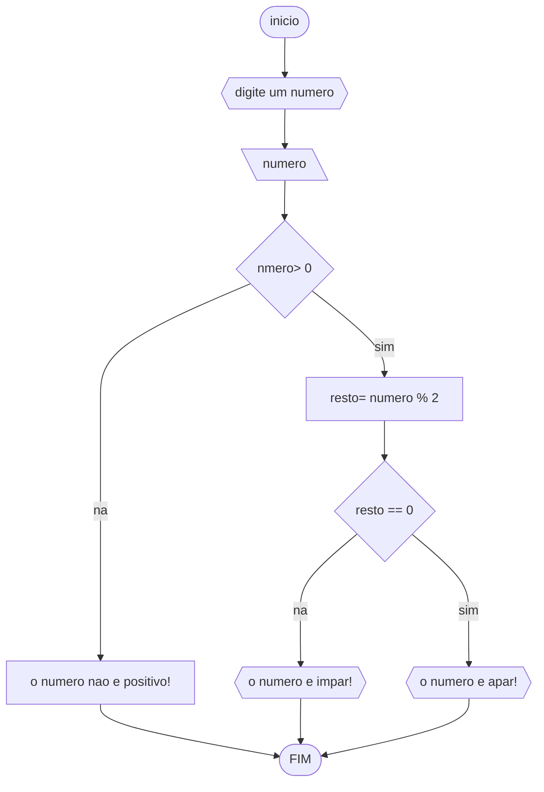
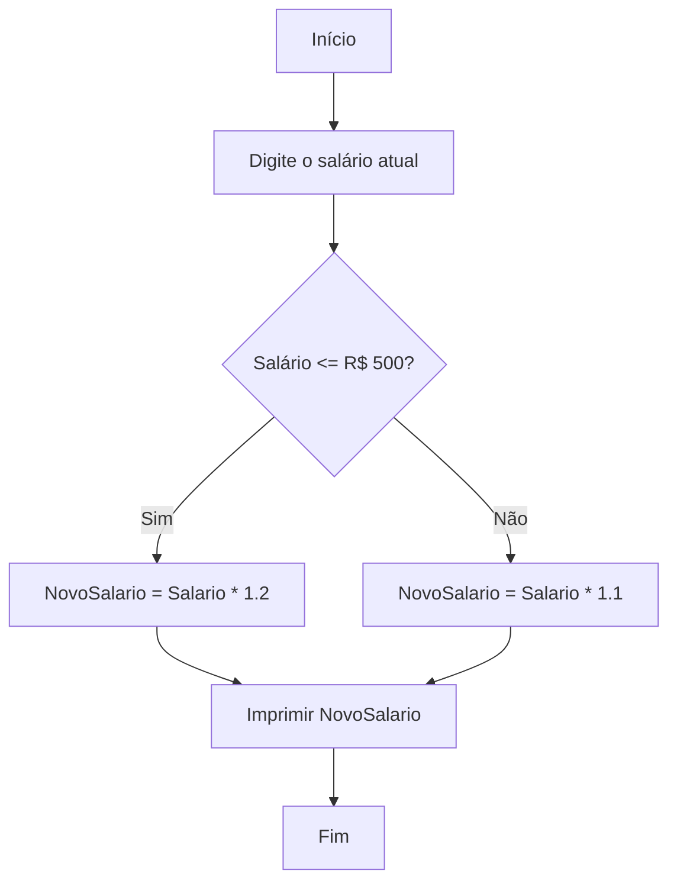

# UNIFOR
**nome**: rinee alves 
**disciplina**:Raciocínio logico algorítmico 
## Lista 1, Exercício 1
### fluxograma 

###Pseudocódigo
```  
1  ALGORITIMO verifica_par_impar
2  DECLARE numero, resto NUMERICO
3  ESCREVA "digite um numero"
4 LEIA numero 
5 SE numero > 0 ENTAO 
6 		resto = numero % 2
7		se resto for == 0 ENTAO
8			ESCREVA "o numero é par!"
9		SENAO
10			ESCREVA "o numero e impar!"
11	SENAO
12		ESCREVA "o numero nao e positivo!"
13FIM_ALGORITIMO
```  
#### Teste de mesa (0,25 ponto)
| numero | numero >= 0 | resto | resto == 0 | Saída |
| -- | -- | -- | -- | -- | 
| -1 | F |   |   | "O número deve ser postivo!" |
| 0  | V | 0 | V | "O número é par!" |
| 13 | V | 1 | F | "O número é impar!" |
| 30 | V | 0 | V | "O número é par!" |


### EXERCICIO 2


###PSEUDOCODIGO
1. Início
2. Digite o salário atual
3. Se salário <= R$ 500 então
4.     NovoSalario = Salario * 1.2 (aumento de 20%)
5. Senão
6.     NovoSalario = Salario * 1.1 (aumento de 10%)
7. Fim Se
8. Imprimir NovoSalario
9. Fim

###EXERCICIO 3
````MERMAID
graph TD
graph TD;
    A[Início] --> B[Digite a primeira nota];
    B --> C[Digite a segunda nota];
    C --> D[Média = (Nota1 + Nota2) / 2];
    D --> E{Média >= 7.0?};
    E -->|Sim| F[Imprimir "Aprovado"];
    E -->|Não| G[Imprimir "Reprovado"];
    F --> H[Fim];
    G --> H;
    H --> I[Término];

````


