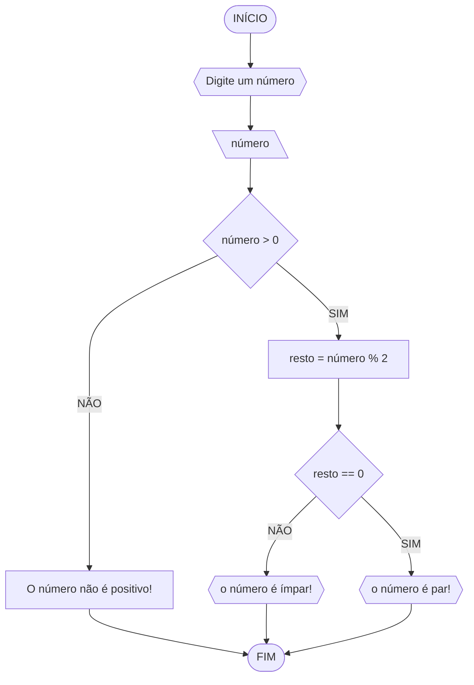
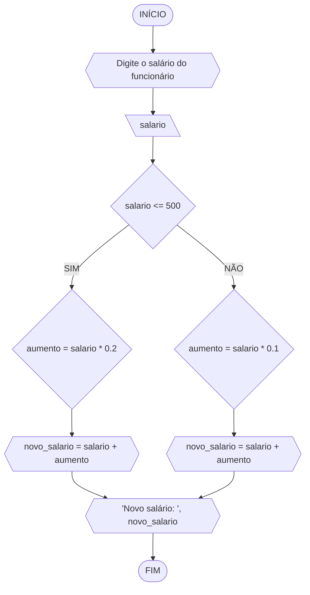
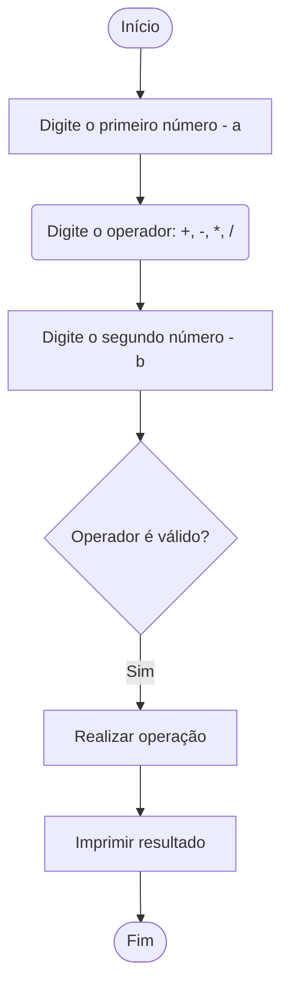
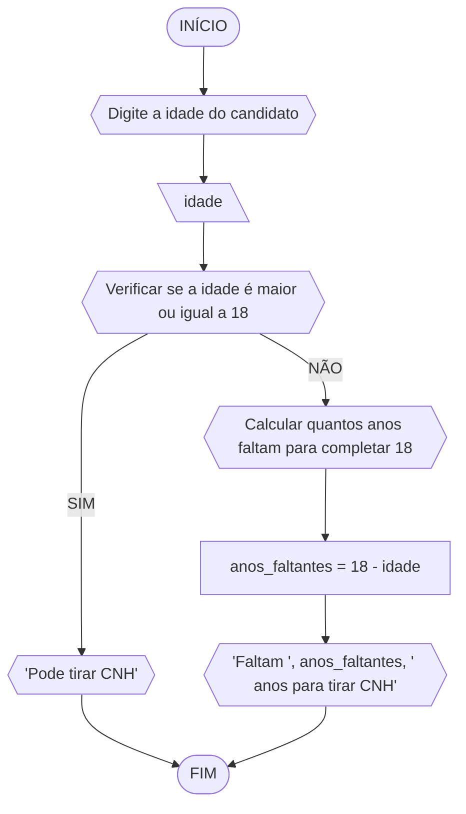

# UNIFOR
**nome**: rinee alves 
**disciplina**:Raciocínio logico algorítmico 

## Lista 1, Exercício 1

### Fluxograma


### Pseudocódigo
```
1  ALGORÍTIMO verificapar_ímpar
2  DECLARE número, resto NUMÉRICO
3  ESCREVA "Digite um número: "
4  LEIA número
5  SE número > 0 ENTÃO
6    resto = número % 2
7    SE resto == 0 ENTÂO
8      ESCREVA "0 número é par!"
9    SENÃO
10     ESCREVA "O número é ímpar!"
11 SENÃO
12  ESCREVA "O número não positivo!"
13 FIM_ALGORITMO
```
#### Teste de mesa
| numero | numero >= 0 | resto | resto == 0 | Saída |
| -- | -- | -- | -- | -- | 
| -1 | F |   |   | "O número deve ser postivo!" |
| 0  | V | 0 | V | "O número é par!" |
| 13 | V | 1 | F | "O número é impar!" |
| 30 | V | 0 | V | "O número é par!" |

### Exercicio 2

### Fluxograma

### Pseudocodigo
```
ALGORITMO calcular_novo_salario
    DECLARE salario, aumento, novo_salario: REAL

    ESCREVA "Digite o salário do funcionário: "
    LEIA salario

    SE salario <= 500 ENTAO
        aumento = salario * 0.2
    SENAO
        aumento = salario * 0.1
    FIM_SE

    novo_salario = salario + aumento

    ESCREVA "Novo salário: ", novo_salario
FIM_ALGORITMO
```
### Teste de mesa
| Etapa | Descrição                                        | Dados/Resultado |
|-------|--------------------------------------------------|------------------|
| Início|                                                |                  |
| Passo 1| Digite o salário do funcionário:               | salario =        |
| Passo 2| Verificar se salario <= 500                     |                  |
|        |   - Verdadeiro:                                |                  |
|        |     - aumento = salario * 0.2                  |                  |
| Passo 3| Calcular novo salário:                         |                  |
|        |     - novo_salario = salario + aumento         |                  |
| Passo 4| Imprimir novo salário:                         | novo_salario     |
| Passo 5| Fim                                            |                  |

### Exercicio 3

### Fluxograma 

#### Pseudocódigo 


Algoritmo Calculadora
```
Início
    Escrever "Digite o primeiro número - a:"
    Ler a
    Escrever "Digite o operador: +, -, *, /:"
    Ler operador
    Escrever "Digite o segundo número - b:"
    Ler b
    
    Se operador é válido Então
        Se operador = "+" Então
            resultado = a + b
        Senão Se operador = "-" Então
            resultado = a - b
        Senão Se operador = "*" Então
            resultado = a * b
        Senão Se operador = "/" E b != 0 Então
            resultado = a / b
        Senão
            Escrever "Operador inválido"
            Retornar
        Fim Se
    Senão
        Escrever "Operador inválido"
        Retornar
    Fim Se
    
    Escrever "O resultado é:", resultado
Fim
```

#### Teste de mesa 

| Etapa | Descrição                              | Dados/Resultado  |
|-------|----------------------------------------|------------------|
| Início|                                        |                  |
| Passo 1| Digite o primeiro número - a:         | a = 10           |
| Passo 2| Digite o operador: +, -, *, /:        |  +                |
| Passo 3| Digite o segundo número - b:          | b = 5            |
| Passo 4| Verificar operador válido:            | Sim              |
| Passo 5| Realizar operação:                    | resultado = 15   |
| Passo 6| Imprimir resultado:                   | 15               |
| Passo 7| Fim                                   |                  |

### Exercicio 4

### Fluxograma

### Pseudocodigo
```
1  ALGORITMO verificar_idade_para_cnh
2  DECLARE idade, anos_faltantes: INTEIRO
3  INICIO
4    ESCREVA "Digite a idade do candidato: "
5    LEIA idade
6    
7    SE idade >= 18 ENTÃO
8        ESCREVA "Pode tirar CNH"
9    SENÃO
10       anos_faltantes = 18 - idade
11       ESCREVA "Faltam ", anos_faltantes, " anos para tirar CNH"
12   FIM_SE
13   
14   FIM

```
#### Teste de mesa 

| Etapa | Descrição                              | Dados/Resultado |
|-------|----------------------------------------|------------------|
| Início|                                        |                  |
| Passo 1| Digite a idade:                       | idade = 12       |
| Passo 2| Verificar idade entre 5 e 7 anos?     | Sim              |
| Passo 3| Verificar idade entre 8 e 10 anos?    | Não              |
| Passo 4| Verificar idade entre 11 e 13 anos?   | Sim              |
| Passo 5| Verificar idade entre 14 e 17 anos?   | Não              |
| Passo 6| Classificar como Juvenil A            |                  |
| Passo 7| Fim                                   |                  |
